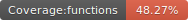
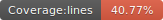
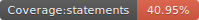

# Podcastjs

<p float="left">
  
  
  
  
</p>

A simple static sitre generatorfor podcasters. Made with love

<!-- 
<p align="center">
  </img>
</p>


A little and friendly buddy to help you in your devops automations.

## requirements

- Nodejs
  - For windows users https://nodejs.org/en/download
  - For linux users I don't need to explain it

- pm2

```
npm install -g pm2
```

- miniops tool

```
git clone https://github.com/usil/miniops.git -b 1.0.0-snapshot
```

## Run - Windows

```
set cron_expression=*/15 * * * * *
set git_url=http://192.168.0.66:6000/asp-xit.git
set git_branch=develop
set yaml_location=C:\foo\bar\acme.yaml

npm run pm2:polling
```

## Run - Linux

```
export cron_expression="*/15 * * * * *"
export git_url=http://192.168.0.66:6000/acme.git
export git_branch=develop
export yaml_location=/foo/bar/acme.yaml

npm run pm2:polling
```

## Logs

```
pm2 flush miniops
pm2 logs miniops
```

## Delete

```
pm2 delete miniops
```

## Update

To try another version:

- delete it

```
pm2 delete miniops
```

- clone or pull
- start again

## References

https://betterstack.com/community/guides/scaling-nodejs/pm2-guide/

-->


## Acknowledgments

- https://themewagon.com/themes/free-bootstrap-4-html5-responsive-musical-website-template-podcast/

## Contributors

<table>
  <tbody>    
    <td>
      
      <br />
      <label><a href="http://jrichardsz.github.io/">JRichardsz</a></label>
      <br />
    </td>
  </tbody>
</table>
