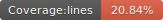

# Podcastjs

<p float="left">
  
  
  
  
</p>

<p align="center">
    
</p>

A simple static site generator for podcasters. Made with love

## Requirements

- Nodejs
- Markdown files
- Mp3 or wav public urls

## How it works

Only add any markdown file inside the posts folder with a content like this:

```
<!-- 

layout : post
title : ¿Cómo crear un programa que aprenda por si solo?
description : Un programa que aprenda de forma autónoma, es algo muy complejo.
category : ai
tags : series, fiction
comments : true 
author : Rich Dotcom
thumbnail_image_url: images/img_3.jpg
datetime_str: 20 September 2017
datetime : 2017-08-20
duration: 0:30:20
sound_url: http://www.largesound.com/ashborytour/sound/AshboryBYU.mp3

-->


Want to report a bug, request a feature, contribute or translate docs4all-ligth? At the moment most things can be
contributed via the main [docs4all-ligth GitHub repository](https://github.com/docs4all/docs4all-ligth).

* [Submit a bug report](https://github.com/docs4all/docs4all-ligth/issues?labels=bug)
* [Submit a feature request](https://github.com/docs4all/docs4all-ligth/issues?labels=enhancement)
* [Submit a pull request](https://github.com/docs4all/docs4all-ligth/pulls)
```

Then run with:


```js
npm run dev
```

Podcastjs will give a landing page with the recent entries


## Home Page

<p align="center">
 
</p>

## Custom site folder

For example, if you are using github.io, a folder called **docs** is required for the static web. 

To do that, set this variable for unix

```
export PODCAST_JS_SITE_FOLDER_NAME=docs   
```

and this for windows


```
set PODCAST_JS_SITE_FOLDER_NAME=docs   
```
## Acknowledgments

- https://themewagon.com/themes/free-bootstrap-4-html5-responsive-musical-website-template-podcast/
- https://www.flaticon.com/free-icon/voice_3178286
- <a href="https://www.flaticon.com/free-icons/voice-chat" title="voice chat icons">Voice chat icons created by Uniconlabs - Flaticon</a>


## Roadmap

check the issues page

## Contributors

<table>
  <tbody>    
    <td>
      
      <br />
      <label><a href="http://jrichardsz.github.io/">JRichardsz</a></label>
      <br />
    </td>
  </tbody>
</table>
