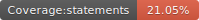

# Podcastjs

<p float="left">
  
  
  
  
</p>

<p align="center">
    
</p>

A simple static site generator for podcasters. Made with love

## Requirements

- Nodejs
- Markdown files
- Mp3 or wav public urls

## Demo

Install the tool

```
npm install -g github:/podcastjs/podcastjs
```

Create new site

```
podcastjs --new-site acme
cd ./acme
```

Start as developer

```
podcastjs --start
```

Go to http://localhost:2708 and you will see something like this

<p align="center">
 
</p>

## Publish

After the creation of your markdowns and settings, if you need a static site to be hosted in some server, follow these steps

Generate the static site

```
podcastjs --publish
```

By default, it creates a **site** folder. If you need a custom folder:

```
podcastjs --publish --output=docs
```

## How it works

Add any markdown file inside the posts folder with a content like this:

```
<!-- 

layout : post
title : Contributing
description : To contribute, follow the nex steps
category : ai
tags : series, fiction
comments : true 
author : Rich Dotcom
thumbnail_image_url: images/img_3.jpg
datetime_str: 20 August 2017
datetime : 2017-08-20
duration: 0:30:20
sound:
  type : simple_url
  value : http://www.largesound.com/ashborytour/sound/AshboryBYU.mp3
  language: en

-->

Here you can put your markdown!!!

```

And  podcast.js will render like this


## Sound files hosts

We suppport the following sound hosts:

- [Vocaroo](https://github.com/podcastjs/podcastjs/wiki/Vocaroo)
- The most simple mp3 hosted anywhere like this http://www.largesound.com/ashborytour/sound/AshboryBYU.mp3

## For nodejs developers (contributors)

Clone this repository and execute

```js
npm run dev
```


## Acknowledgments

- https://themewagon.com/themes/free-bootstrap-4-html5-responsive-musical-website-template-podcast/
- https://www.flaticon.com/free-icon/voice_3178286
- <a href="https://www.flaticon.com/free-icons/voice-chat" title="voice chat icons">Voice chat icons created by Uniconlabs - Flaticon</a>
- <a href="https://www.flaticon.com/free-icons/spanish" title="spanish icons">Spanish icons created by Freepik - Flaticon</a>


## Roadmap

- Check the issues page

## Contributors

<table>
  <tbody>    
    <td>
      
      <br />
      <label><a href="http://jrichardsz.github.io/">JRichardsz</a></label>
      <br />
    </td>
  </tbody>
</table>
